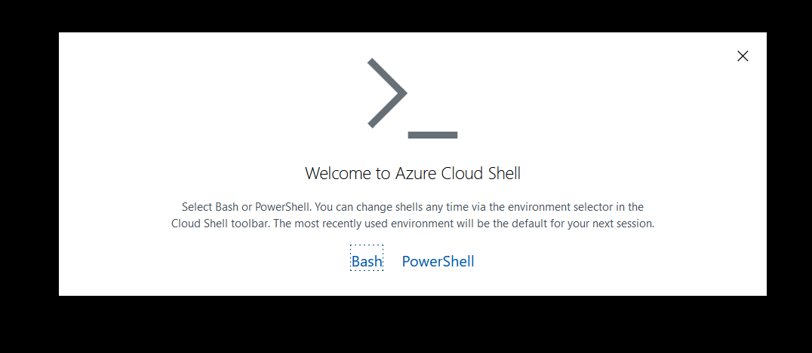
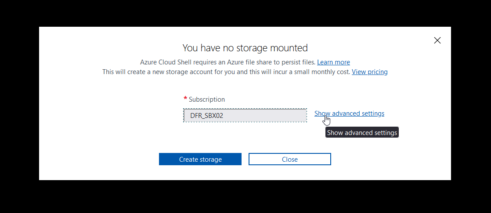
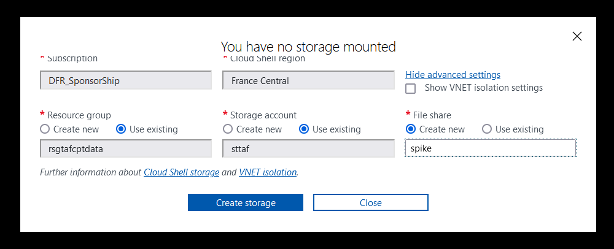

# Lab 0

In this first lab, we initiate the environment for the following lab.

## 1. Tools required for interacting kubernetes in Azure

To interact with Azure Kubernetes Service, the following tools are required:

- [az cli](https://learn.microsoft.com/en-us/cli/azure/install-azure-cli)
- [kubectl](https://kubernetes.io/docs/tasks/tools/install-kubectl-linux/)
- a text editor such as vim or [vscode](https://code.visualstudio.com/Download)

Additionaly, to install packaged application, it can be useful to rely on existing helm chart and thus have the [helm cli](https://helm.sh/docs/intro/install/) available.

Last, the [Git cli](https://git-scm.com/book/en/v2/Getting-Started-Installing-Git) is required to clone this repository.

## 2. Using Cloud Shell

Azure Cloud Shell comes with all those tools already available.

To create a Cloud Shell, access the uri **https://shell.azure.com**.

You will be prompted to choose between bash and PowerShell. Kubernetes being more linux friendly, choose Bash.  
  
  
  
Select Advanced Settings to display more options for the target storage.

  
  
It is possible to either create or select the an existing storage account. Also, a share is required


  
Once the shell is loaded, check that all the required tools are available

```bash

spike [ ~ ]$ kubectl version
WARNING: This version information is deprecated and will be replaced with the output from kubectl version --short.  Use --output=yaml|json to get the full version.
Client Version: version.Info{Major:"1", Minor:"25", GitVersion:"v1.25.3", GitCommit:"434bfd82814af038ad94d62ebe59b133fcb50506", GitTreeState:"clean", BuildDate:"2022-10-12T10:57:26Z", GoVersion:"go1.19.2", Compiler:"gc", Platform:"linux/amd64"}
Kustomize Version: v4.5.7
error: You must be logged in to the server (the server has asked for the client to provide credentials)

spike [ ~ ]$ helm version
version.BuildInfo{Version:"v3.9.3", GitCommit:"", GitTreeState:"clean", GoVersion:"go1.18.5"}

spike [ ~ ]$ git version
git version 2.33.4

```

You can also modify your bash profile to have an alias for kubectl.
Open the bashrc file with vim.
  
```bash

spike [ ~ ]$ ls ~/.bashrc
/home/spike/.bashrc
spike [ ~ ]$ vim ~/.bash
.bash_history  .bash_logout   .bash_profile  .bashrc        
spike [ ~ ]$ vim ~/.bashrc

```

```bash

alias k=kubectl

```