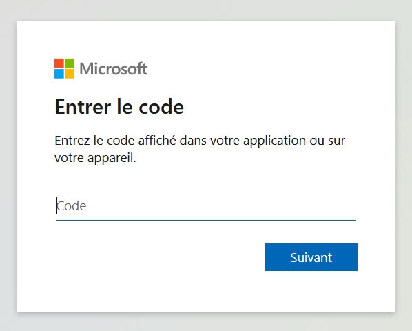

# Start interacting with your cluster

## 1. Explore kubectl config

With your Cloud Shell environment, you should now be able to interact with your cluster.

Start by idenfying your cluster name with the appropriate az cli command:

```bash

yumemaru@Azure:~$ az aks list | jq .[].name
"aks-1"
"aks-2"
"aks-3"

yumemaru@Azure:~$ az aks list | jq .[].resourceGroup
"rsg-akstraining1"
"rsg-akstraining2"
"rsg-akstraining3"

```

Once you know which cluster you should connect to, use the az aks get-credentials command:

```bash

yumemaru@Azure:~$ az aks get-credentials -n aks-1 -g rsg-aksIdentityState1
Merged "aks-1" as current context in /home/david/.kube/config

```

With this command, you added the AKS cluster in your context through the config file.
Depending on your OS, the path may change but the file is always called `config` and located in a folder called `.kube`.
You can check the configuration either by looking at the file directly or through the kubectcl command.

```bash

yumemaru@Azure:~$ k config view
apiVersion: v1
clusters:
- cluster:
    certificate-authority-data: DATA+OMITTED
    server: https://akstfmoduledev-7565dbc3.hcp.eastus.azmk8s.io:443
  name: aks-1
- cluster:
    certificate-authority-data: DATA+OMITTED
    server: https://akstfmoduledev-d0037165.hcp.eastus.azmk8s.io:443
  name: aks-2
- cluster:
    certificate-authority-data: DATA+OMITTED
    server: https://akstfmoduledev-cc12acee.hcp.eastus.azmk8s.io:443
  name: aks-3
contexts:
- context:
    cluster: aks-1
    user: clusterUser_rsg-aksIdentityState1_aks-1
  name: aks-1
- context:
    cluster: aks-2
    user: clusterUser_rsg-aksIdentityState2_aks-2
  name: aks-2
- context:
    cluster: aks-3
    user: clusterUser_rsg-aksIdentityState3_aks-3
  name: aks-3
current-context: aks-1
kind: Config
preferences: {}
users:
- name: clusterUser_rsg-aksIdentityState1_aks-1
  user:
    exec:
      apiVersion: client.authentication.k8s.io/v1beta1
      args:
      - get-token
      - --login
      - devicecode
      - --server-id
      - 00000000-0000-0000-0000-000000000000
      - --client-id
      - 00000000-0000-0000-0000-000000000000
      - --tenant-id
      - 00000000-0000-0000-0000-000000000000
      - --environment
      - AzurePublicCloud
      command: kubelogin
      env: null
      interactiveMode: IfAvailable
      provideClusterInfo: false
- name: clusterUser_rsg-aksIdentityState2_aks-2
  user:
    exec:
      apiVersion: client.authentication.k8s.io/v1beta1
      args:
      - get-token
      - --login
      - devicecode
      - --server-id
      - 00000000-0000-0000-0000-000000000000
      - --client-id
      - 00000000-0000-0000-0000-000000000000
      - --tenant-id
      - 00000000-0000-0000-0000-000000000000
      - --environment
      - AzurePublicCloud
      command: kubelogin
      env: null
      interactiveMode: IfAvailable
      provideClusterInfo: false
- name: clusterUser_rsg-aksIdentityState3_aks-3
  user:
    exec:
      apiVersion: client.authentication.k8s.io/v1beta1
      args:
      - get-token
      - --login
      - devicecode
      - --server-id
      - 00000000-0000-0000-0000-000000000000
      - --client-id
      - 00000000-0000-0000-0000-000000000000
      - --tenant-id
      - 00000000-0000-0000-0000-000000000000
      - --environment
      - AzurePublicCloud
      command: kubelogin
      env: null
      interactiveMode: IfAvailable
      provideClusterInfo: false

```

```bash

yumemaru@Azure:~$ cat ~/.kube/config 
apiVersion: v1
clusters:
- cluster:
    certificate-authority-data: 
    server: https://akstfmoduledev-7565dbc3.hcp.eastus.azmk8s.io:443
  name: aks-1
- cluster:
    certificate-authority-data: 
    server: https://akstfmoduledev-d0037165.hcp.eastus.azmk8s.io:443
  name: aks-2
- cluster:
    certificate-authority-data: 
    server: https://akstfmoduledev-cc12acee.hcp.eastus.azmk8s.io:443
  name: aks-3
contexts:
- context:
    cluster: aks-1
    user: clusterUser_rsg-aksIdentityState1_aks-1
  name: aks-1
- context:
    cluster: aks-2
    user: clusterUser_rsg-aksIdentityState2_aks-2
  name: aks-2
- context:
    cluster: aks-3
    user: clusterUser_rsg-aksIdentityState3_aks-3
  name: aks-3
current-context: aks-1
kind: Config
preferences: {}
users:
- name: clusterUser_rsg-aksIdentityState1_aks-1
  user:
    exec:
      apiVersion: client.authentication.k8s.io/v1beta1
      args:
      - get-token
      - --login
      - devicecode
      - --server-id
      - 00000000-0000-0000-0000-000000000000
      - --client-id
      - 00000000-0000-0000-0000-000000000000
      - --tenant-id
      - 00000000-0000-0000-0000-000000000000
      - --environment
      - AzurePublicCloud
      command: kubelogin
      env: null
      interactiveMode: IfAvailable
      provideClusterInfo: false
- name: clusterUser_rsg-aksIdentityState2_aks-2
  user:
    exec:
      apiVersion: client.authentication.k8s.io/v1beta1
      args:
      - get-token
      - --login
      - devicecode
      - --server-id
      - 00000000-0000-0000-0000-000000000000
      - --client-id
      - 00000000-0000-0000-0000-000000000000
      - --tenant-id
      - 00000000-0000-0000-0000-000000000000
      - --environment
      - AzurePublicCloud
      command: kubelogin
      env: null
      provideClusterInfo: false
- name: clusterUser_rsg-aksIdentityState3_aks-3
  user:
    exec:
      apiVersion: client.authentication.k8s.io/v1beta1
      args:
      - get-token
      - --login
      - devicecode
      - --server-id
      - 00000000-0000-0000-0000-000000000000
      - --client-id
      - 00000000-0000-0000-0000-000000000000
      - --tenant-id
      - 00000000-0000-0000-0000-000000000000
      - --environment
      - AzurePublicCloud
      command: kubelogin
      env: null
      interactiveMode: IfAvailable
      provideClusterInfo: false

```

`kubectl` can point to more than one cluster. This is visible with the config file either directly of through `kubectl config` command.

Check the current context with the folowing command:

```bash

yumemaru@Azure:~$ k config current-context
aks-3

```

If you have more than one cluster available, you can use the following command to disply a short list:

```bash

yumemaru@Azure:~$ kubectl config get-contexts 
CURRENT   NAME    CLUSTER   AUTHINFO                             NAMESPACE
          aks-1   aks-1     clusterUser_rsg-aksTraining1_aks-1   
          aks-2   aks-2     clusterUser_rsg-aksTraining2_aks-2   
*         aks-3   aks-3     clusterUser_rsg-aksTraining3_aks-3   

```

**Note**: If you have only one cluster in your context, try to add others through commands previously used.

Switch context by using the following command:

```bash

yumemaru@Azure:~$ k config use-context aks-1
Switched to context "aks-1".

```

Note that the context change is also visible if you use the kubectl config get-contexts again
  
```bash

yumemaru@Azure:~$ kubectl config get-contexts 
CURRENT   NAME    CLUSTER   AUTHINFO                             NAMESPACE
*         aks-1   aks-1     clusterUser_rsg-aksTraining1_aks-1   
          aks-2   aks-2     clusterUser_rsg-aksTraining2_aks-2   
          aks-3   aks-3     clusterUser_rsg-aksTraining3_aks-3  

```

That's all for kube config!

You can also check [kubectx](https://github.com/ahmetb/kubectx) if you want to test a tool aiming to help switching between context.
  
## 2. Explore your cluster

Now that we know how to navigate between clusters, let's explore a little the basics objects available

Before anything, **ALWAYS** verify on which cluster your kubectl is pointing. Use the appropriate command to check your current context.

```bash

yumemaru@Azure:~$ kubectl xxxxxx xxxxxxx-xxxxxxx
aks-1

```

Let's start by checking the nodes available.

```bash

yumemaru@Azure:~$ kubectl get nodes
W1123 11:11:12.064363    6512 azure.go:92] WARNING: the azure auth plugin is deprecated in v1.22+, unavailable in v1.26+; use https://github.com/Azure/kubelogin instead.
To learn more, consult https://kubernetes.io/docs/reference/access-authn-authz/authentication/#client-go-credential-plugins
To sign in, use a web browser to open the page https://microsoft.com/devicelogin and enter the code DEC385XZP to authenticate.

```

Note the warning message first and then the sign in request.
Because our clusters are AKS clusters, we have a dependency with Azure Active Directory for authentication.
Click on the sign in link in your terminal and specify the one time password. You will be propted to authenticate on Azure.

  
  
  
  
 

With the completion of the authentication, the kubectl display the command result:

```bash

NAME                              STATUS   ROLES   AGE   VERSION
aks-aksnp01-12766035-vmss000003   Ready    agent   79m   v1.23.12
aks-aksnp01-12766035-vmss000004   Ready    agent   79m   v1.23.12

```

Note that in AKS, the nodes are regrouped by node pools, but it is not directly visible through the kubectl command because kubernetes knows of nodes, while it is Azure that knows of node pools which are scale sets.

To get more information on the nodes, use the follwing command :

```bash

yumemaru@Azure:~$ k describe nodes aks-aksnp01-12766035-vmss000003
W1123 10:27:28.318501     137 azure.go:92] WARNING: the azure auth plugin is deprecated in v1.22+, unavailable in v1.26+; use https://github.com/Azure/kubelogin instead.
To learn more, consult https://kubernetes.io/docs/reference/access-authn-authz/authentication/#client-go-credential-plugins
Name:               aks-aksnp01-12766035-vmss000003
Roles:              agent
Labels:             agentpool=aksnp01
                    beta.kubernetes.io/arch=amd64
                    beta.kubernetes.io/instance-type=standard_d2s_v4
                    beta.kubernetes.io/os=linux
                    failure-domain.beta.kubernetes.io/region=eastus
                    failure-domain.beta.kubernetes.io/zone=0
                    kubernetes.azure.com/agentpool=aksnp01
                    kubernetes.azure.com/cluster=rsg-dfitcfr-dev-tfmodule-aksobjects1
                    kubernetes.azure.com/kubelet-identity-client-id=0ae7ffcf-ad64-44bb-82b4-0b5d5aa791b0
                    kubernetes.azure.com/mode=system
                    kubernetes.azure.com/node-image-version=AKSUbuntu-1804gen2containerd-2022.11.02
                    kubernetes.azure.com/os-sku=Ubuntu
                    kubernetes.azure.com/role=agent
                    kubernetes.azure.com/storageprofile=managed
                    kubernetes.azure.com/storagetier=Premium_LRS
                    kubernetes.io/arch=amd64
                    kubernetes.io/hostname=aks-aksnp01-12766035-vmss000003
                    kubernetes.io/os=linux
                    kubernetes.io/role=agent
                    node-role.kubernetes.io/agent=
                    node.kubernetes.io/instance-type=standard_d2s_v4
                    storageprofile=managed
                    storagetier=Premium_LRS
                    topology.disk.csi.azure.com/zone=
                    topology.kubernetes.io/region=eastus
                    topology.kubernetes.io/zone=0
Annotations:        csi.volume.kubernetes.io/nodeid:
                      {"disk.csi.azure.com":"aks-aksnp01-12766035-vmss000003","file.csi.azure.com":"aks-aksnp01-12766035-vmss000003"}
                    node.alpha.kubernetes.io/ttl: 0
                    projectcalico.org/IPv4Address: 172.22.0.4/24
                    volumes.kubernetes.io/controller-managed-attach-detach: true
CreationTimestamp:  Wed, 23 Nov 2022 09:04:31 +0000
Taints:             <none>
Unschedulable:      false
Lease:
  HolderIdentity:  aks-aksnp01-12766035-vmss000003
  AcquireTime:     <unset>
  RenewTime:       Wed, 23 Nov 2022 10:27:24 +0000
Conditions:
  Type                          Status  LastHeartbeatTime                 LastTransitionTime                Reason                          Message
  ----                          ------  -----------------                 ------------------                ------                          -------
  FreezeScheduled               False   Wed, 23 Nov 2022 10:25:32 +0000   Wed, 23 Nov 2022 09:04:53 +0000   NoFreezeScheduled               VM has no scheduled Freeze event
  FilesystemCorruptionProblem   False   Wed, 23 Nov 2022 10:25:32 +0000   Wed, 23 Nov 2022 09:04:53 +0000   FilesystemIsOK                  Filesystem is healthy
  RedeployScheduled             False   Wed, 23 Nov 2022 10:25:32 +0000   Wed, 23 Nov 2022 09:04:53 +0000   NoRedeployScheduled             VM has no scheduled Redeploy event
  TerminateScheduled            False   Wed, 23 Nov 2022 10:25:32 +0000   Wed, 23 Nov 2022 09:04:53 +0000   NoTerminateScheduled            VM has no scheduled Terminate event
  FrequentUnregisterNetDevice   False   Wed, 23 Nov 2022 10:25:32 +0000   Wed, 23 Nov 2022 09:04:53 +0000   NoFrequentUnregisterNetDevice   node is functioning properly
  FrequentDockerRestart         False   Wed, 23 Nov 2022 10:25:32 +0000   Wed, 23 Nov 2022 09:04:53 +0000   NoFrequentDockerRestart         docker is functioning properly
  KernelDeadlock                False   Wed, 23 Nov 2022 10:25:32 +0000   Wed, 23 Nov 2022 09:04:53 +0000   KernelHasNoDeadlock             kernel has no deadlock
  ReadonlyFilesystem            False   Wed, 23 Nov 2022 10:25:32 +0000   Wed, 23 Nov 2022 09:04:53 +0000   FilesystemIsNotReadOnly         Filesystem is not read-only
  FrequentContainerdRestart     False   Wed, 23 Nov 2022 10:25:32 +0000   Wed, 23 Nov 2022 09:04:53 +0000   NoFrequentContainerdRestart     containerd is functioning properly
  PreemptScheduled              False   Wed, 23 Nov 2022 10:25:32 +0000   Wed, 23 Nov 2022 09:05:23 +0000   NoPreemptScheduled              VM has no scheduled Preempt event
  RebootScheduled               False   Wed, 23 Nov 2022 10:25:32 +0000   Wed, 23 Nov 2022 09:04:53 +0000   NoRebootScheduled               VM has no scheduled Reboot event
  KubeletProblem                False   Wed, 23 Nov 2022 10:25:32 +0000   Wed, 23 Nov 2022 09:04:53 +0000   KubeletIsUp                     kubelet service is up
  FrequentKubeletRestart        False   Wed, 23 Nov 2022 10:25:32 +0000   Wed, 23 Nov 2022 09:04:53 +0000   NoFrequentKubeletRestart        kubelet is functioning properly
  VMEventScheduled              False   Wed, 23 Nov 2022 10:25:32 +0000   Wed, 23 Nov 2022 09:05:23 +0000   NoVMEventScheduled              VM has no scheduled event
  ContainerRuntimeProblem       False   Wed, 23 Nov 2022 10:25:32 +0000   Wed, 23 Nov 2022 09:04:53 +0000   ContainerRuntimeIsUp            container runtime service is up
  NetworkUnavailable            False   Wed, 23 Nov 2022 09:05:30 +0000   Wed, 23 Nov 2022 09:05:30 +0000   RouteCreated                    RouteController created a route
  MemoryPressure                False   Wed, 23 Nov 2022 10:27:22 +0000   Wed, 23 Nov 2022 09:04:31 +0000   KubeletHasSufficientMemory      kubelet has sufficient memory available
  DiskPressure                  False   Wed, 23 Nov 2022 10:27:22 +0000   Wed, 23 Nov 2022 09:04:31 +0000   KubeletHasNoDiskPressure        kubelet has no disk pressure
  PIDPressure                   False   Wed, 23 Nov 2022 10:27:22 +0000   Wed, 23 Nov 2022 09:04:31 +0000   KubeletHasSufficientPID         kubelet has sufficient PID available
  Ready                         True    Wed, 23 Nov 2022 10:27:22 +0000   Wed, 23 Nov 2022 09:05:02 +0000   KubeletReady                    kubelet is posting ready status. AppArmor enabled
Addresses:
  InternalIP:  172.22.0.4
  Hostname:    aks-aksnp01-12766035-vmss000003
Capacity:
  cpu:                2
  ephemeral-storage:  128869872Ki
  hugepages-1Gi:      0
  hugepages-2Mi:      0
  memory:             8148464Ki
  pods:               100
Allocatable:
  cpu:                1900m
  ephemeral-storage:  118766473839
  hugepages-1Gi:      0
  hugepages-2Mi:      0
  memory:             5493232Ki
  pods:               100
System Info:
  Machine ID:                 eb1c6346386c423ea20c5bf6c6a266a4
  System UUID:                3b091db6-23d5-4a7a-9904-c8630263c781
  Boot ID:                    9d653e7f-904f-4583-97b8-4a10b024e0bd
  Kernel Version:             5.4.0-1094-azure
  OS Image:                   Ubuntu 18.04.6 LTS
  Operating System:           linux
  Architecture:               amd64
  Container Runtime Version:  containerd://1.6.4+azure-4
  Kubelet Version:            v1.23.12
  Kube-Proxy Version:         v1.23.12
PodCIDR:                      10.244.0.0/24
PodCIDRs:                     10.244.0.0/24
ProviderID:                   azure:///subscriptions/00000000-0000-0000-0000-000000000000/resourceGroups/rsg-dfitcfr-dev-tfmodule-aksobjects1/providers/Microsoft.Compute/virtualMachineScaleSets/aks-aksnp01-12766035-vmss/virtualMachines/3
Non-terminated Pods:          (15 in total)
  Namespace                   Name                                      CPU Requests  CPU Limits  Memory Requests  Memory Limits  Age
  ---------                   ----                                      ------------  ----------  ---------------  -------------  ---
  calico-system               calico-node-8srkz                         0 (0%)        0 (0%)      0 (0%)           0 (0%)         82m
  calico-system               calico-typha-b7bb865cf-t6fxh              0 (0%)        0 (0%)      0 (0%)           0 (0%)         83m
  gatekeeper-system           gatekeeper-audit-75cc4b59d7-t4lj6         100m (5%)     2 (105%)    256Mi (4%)       3Gi (57%)      83m
  gatekeeper-system           gatekeeper-controller-68ff9cf4bb-qsmjw    100m (5%)     2 (105%)    256Mi (4%)       2Gi (38%)      83m
  kube-system                 cloud-node-manager-q2zs9                  50m (2%)      0 (0%)      50Mi (0%)        512Mi (9%)     82m
  kube-system                 coredns-autoscaler-5589fb5654-jw7rz       20m (1%)      200m (10%)  10Mi (0%)        500Mi (9%)     83m
  kube-system                 coredns-b4854dd98-lgxl5                   100m (5%)     3 (157%)    70Mi (1%)        500Mi (9%)     83m
  kube-system                 csi-azuredisk-node-k5m52                  30m (1%)      0 (0%)      60Mi (1%)        400Mi (7%)     82m
  kube-system                 csi-azurefile-node-bq2wv                  30m (1%)      0 (0%)      60Mi (1%)        600Mi (11%)    82m
  kube-system                 konnectivity-agent-7ddd46486c-mb8d9       20m (1%)      1 (52%)     20Mi (0%)        1Gi (19%)      83m
  kube-system                 kube-proxy-484d4                          100m (5%)     0 (0%)      0 (0%)           0 (0%)         82m
  kube-system                 metrics-server-f77b4cd8-jfdd8             44m (2%)      1 (52%)     55Mi (1%)        2000Mi (37%)   83m
  kube-system                 metrics-server-f77b4cd8-kg847             44m (2%)      1 (52%)     55Mi (1%)        2000Mi (37%)   83m
  kube-system                 microsoft-defender-collector-ds-mcqfn     60m (3%)      210m (11%)  96Mi (1%)        192Mi (3%)     17m
  kube-system                 microsoft-defender-publisher-ds-xqd8z     30m (1%)      60m (3%)    32Mi (0%)        200Mi (3%)     17m
Allocated resources:
  (Total limits may be over 100 percent, i.e., overcommitted.)
  Resource           Requests      Limits
  --------           --------      ------
  cpu                728m (38%)    10470m (551%)
  memory             1020Mi (19%)  13048Mi (243%)
  ephemeral-storage  0 (0%)        0 (0%)
  hugepages-1Gi      0 (0%)        0 (0%)
  hugepages-2Mi      0 (0%)        0 (0%)
Events:
  Type    Reason          Age   From             Message
  ----    ------          ----  ----             -------
  Normal  RegisteredNode  48m   node-controller  Node aks-aksnp01-12766035-vmss000003 event: Registered Node aks-aksnp01-12766035-vmss000003 in Controller
  Normal  RegisteredNode  17m   node-controller  Node aks-aksnp01-12766035-vmss000003 event: Registered Node aks-aksnp01-12766035-vmss000003 in Controller

```

Note that we can use the describe or the get commands and specify a node by its name to focus the command on a specific target.

The describe commands give many more information, but it is also possible to get more information with the get command.

Before trying other parameters, let's get rid of the warning that we have for ech kubectl command.
If you read the message, you will have notice that a change in the authentication plugin is responsible of the warning.
To eliminate the message,we have to use [kubelogin](https://github.com/Azure/kubelogin) to convert the kube config file. By chance, it is available in the Cloud Shell:

```bash

yumemaru@Azure:~$ kubelogin --version
kubelogin version 
git hash: v0.0.20/872ed59b23e06c3a0eb950cb67e7bd2b0e9d48d7
Go version: go1.18.5
Build time: 2022-08-09T18:30:45Z
Platform: linux/amd64

yumemaru@Azure:~$ kubelogin convert-kubeconfig

```

Now that the kube config is converted, we shoould not have the warning again.
Try the following command:  

```bash

yumemaru@Azure:~$ kubectl get nodes -o wide

yumemaru@Azure:~$ kubectl get nodes aks-aksnp01-12766035-vmss000003 -o yaml

yumemaru@Azure:~$ kubectl get nodes aks-aksnp01-12766035-vmss000003 -o json

yumemaru@Azure:~$ kubectl get nodes aks-aksnp01-12766035-vmss000003 -o json | jq .metadata.labels

```

There are other ways to parse the result, included in the kubectl command with jsonpath. Some examples can be found on kubernetes [documentation](https://kubernetes.io/docs/reference/kubectl/cheatsheet/) but htis is out of this training scope.

Now that we have explored the nodes, try to explore others objects, such as pods and namespaces, services, secrets and configmap.
