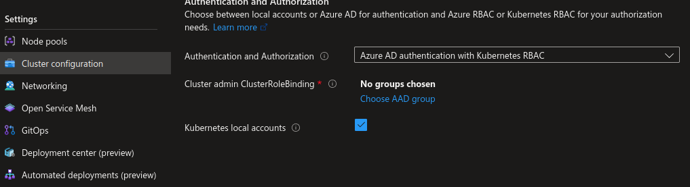

# Create your first AKS Cluster

There are many ways to create an AKS cluster.
Az cli is one and it provides all options for creation. 
Check the [az aks cli documentation](https://learn.microsoft.com/en-us/cli/azure/aks?view=azure-cli-latest#az-aks-create)
After looking at the different parameters, use the following command to create an AKS cluster

```bash

yumemaru@Azure:~/LabAKS$ az aks create --resource-group <resource_group_name> --name <aks_cluster_name> --enable-aad --enable-oidc-issuer --load-balancer-sku standard --location eastus --network-plugin kubenet --network-policy calico --zones 1 2 3 --generate-ssh-keys
{
  "aadProfile": {
    "adminGroupObjectIDs": null,
    "adminUsers": null,
    "clientAppId": null,
    "enableAzureRbac": false,
    "managed": true,
    "serverAppId": null,
    "serverAppSecret": null,
    "tenantId": "00000000-0000-0000-0000-000000000000"
  },
  "addonProfiles": null,
  "agentPoolProfiles": [
    {
      "availabilityZones": [
        "1",
        "2",
        "3"
      ],
      "count": 3,
      "creationData": null,
      "currentOrchestratorVersion": "1.23.12",
      "enableAutoScaling": false,
      "enableEncryptionAtHost": false,
      "enableFips": false,
      "enableNodePublicIp": false,
      "enableUltraSsd": false,
      "gpuInstanceProfile": null,
      "hostGroupId": null,
      "kubeletConfig": null,
      "kubeletDiskType": "OS",
      "linuxOsConfig": null,
      "maxCount": null,
      "maxPods": 110,
      "minCount": null,
      "mode": "System",
      "name": "nodepool1",
      "nodeImageVersion": "AKSUbuntu-1804gen2containerd-2022.11.02",
      "nodeLabels": null,
      "nodePublicIpPrefixId": null,
      "nodeTaints": null,
      "orchestratorVersion": "1.23.12",
      "osDiskSizeGb": 128,
      "osDiskType": "Managed",
      "osSku": "Ubuntu",
      "osType": "Linux",
      "podSubnetId": null,
      "powerState": {
        "code": "Running"
      },
      "provisioningState": "Succeeded",
      "proximityPlacementGroupId": null,
      "scaleDownMode": null,
      "scaleSetEvictionPolicy": null,
      "scaleSetPriority": null,
      "spotMaxPrice": null,
      "tags": null,
      "type": "VirtualMachineScaleSets",
      "upgradeSettings": {
        "maxSurge": null
      },
      "vmSize": "Standard_DS2_v2",
      "vnetSubnetId": null,
      "workloadRuntime": null
    }
  ],
  "apiServerAccessProfile": null,
  "autoScalerProfile": null,
  "autoUpgradeProfile": null,
  "azurePortalFqdn": "akscli-1-rsg-akstraining1-16e85b-e4543b4e.portal.hcp.eastus.azmk8s.io",
  "currentKubernetesVersion": "1.23.12",
  "disableLocalAccounts": false,
  "diskEncryptionSetId": null,
  "dnsPrefix": "akscli-1-rsg-aksTraining1-16e85b",
  "enablePodSecurityPolicy": null,
  "enableRbac": true,
  "extendedLocation": null,
  "fqdn": "akscli-1-rsg-akstraining1-16e85b-e4543b4e.hcp.eastus.azmk8s.io",
  "fqdnSubdomain": null,
  "httpProxyConfig": null,
  "id": "/subscriptions/00000000-0000-0000-0000-000000000000/resourcegroups/rsg-aksTraining1/providers/Microsoft.ContainerService/managedClusters/akscli-1",
  "identity": {
    "principalId": "00000000-0000-0000-0000-000000000000",
    "tenantId": "00000000-0000-0000-0000-000000000000",
    "type": "SystemAssigned",
    "userAssignedIdentities": null
  },
  "identityProfile": {
    "kubeletidentity": {
      "clientId": "00000000-0000-0000-0000-000000000000",
      "objectId": "00000000-0000-0000-0000-000000000000",
      "resourceId": "/subscriptions/00000000-0000-0000-0000-000000000000/resourcegroups/MC_rsg-aksTraining1_akscli-1_eastus/providers/Microsoft.ManagedIdentity/userAssignedIdentities/akscli-1-agentpool"
    }
  },
  "kubernetesVersion": "1.23.12",
  "linuxProfile": {
    "adminUsername": "azureuser",
    "ssh": {
      "publicKeys": [
        {
          "keyData": ""
        }
      ]
    }
  },
  "location": "eastus",
  "maxAgentPools": 100,
  "name": "akscli-1",
  "networkProfile": {
    "dnsServiceIp": "10.0.0.10",
    "dockerBridgeCidr": "172.17.0.1/16",
    "ipFamilies": [
      "IPv4"
    ],
    "loadBalancerProfile": {
      "allocatedOutboundPorts": null,
      "effectiveOutboundIPs": [
        {
          "id": "/subscriptions/00000000-0000-0000-0000-000000000000/resourceGroups/MC_rsg-aksTraining1_akscli-1_eastus/providers/Microsoft.Network/publicIPAddresses/470175d3-c908-4667-ae98-6f74b222056e",
          "resourceGroup": "MC_rsg-aksTraining1_akscli-1_eastus"
        }
      ],
      "enableMultipleStandardLoadBalancers": null,
      "idleTimeoutInMinutes": null,
      "managedOutboundIPs": {
        "count": 1,
        "countIpv6": null
      },
      "outboundIPs": null,
      "outboundIpPrefixes": null
    },
    "loadBalancerSku": "Standard",
    "natGatewayProfile": null,
    "networkMode": null,
    "networkPlugin": "kubenet",
    "networkPolicy": "calico",
    "outboundType": "loadBalancer",
    "podCidr": "10.244.0.0/16",
    "podCidrs": [
      "10.244.0.0/16"
    ],
    "serviceCidr": "10.0.0.0/16",
    "serviceCidrs": [
      "10.0.0.0/16"
    ]
  },
  "nodeResourceGroup": "MC_rsg-aksTraining1_akscli-1_eastus",
  "oidcIssuerProfile": {
    "enabled": true,
    "issuerUrl": "https://eastus.oic.prod-aks.azure.com/00000000-0000-0000-0000-000000000000/728aecf6-13a2-4d60-9d47-0b89e1cda492/"
  },
  "podIdentityProfile": null,
  "powerState": {
    "code": "Running"
  },
  "privateFqdn": null,
  "privateLinkResources": null,
  "provisioningState": "Succeeded",
  "publicNetworkAccess": null,
  "resourceGroup": "rsg-aksTraining1",
  "securityProfile": {
    "azureKeyVaultKms": null,
    "defender": null
  },
  "servicePrincipalProfile": {
    "clientId": "msi",
    "secret": null
  },
  "sku": {
    "name": "Basic",
    "tier": "Free"
  },
  "storageProfile": {
    "blobCsiDriver": null,
    "diskCsiDriver": {
      "enabled": true
    },
    "fileCsiDriver": {
      "enabled": true
    },
    "snapshotController": {
      "enabled": true
    }
  },
  "systemData": null,
  "tags": null,
  "type": "Microsoft.ContainerService/ManagedClusters",
  "windowsProfile": null
}

```

Check your cluster on the portal, specifically the API DNS name, and in the Cluster configuration section.

  

  

Find which parameters should be used to specify the missing configuration.

What is the usage of the `--network-policy` parameter?

What happens if the `--network-plugin` parameter is set to none?