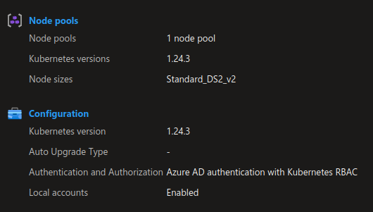

# Upgrade AKS Cluster

Through AKS, the process of upgrade is included in the az cli rather than done manually on the OS side of the control plane.
It is still on the client side of responsibiltiy to perform the upgrade. The available upgrade version are however delivered by Azure
Find the available version upgrade for your cluster

```bash

yumemaru@Azure:~/LabAKS$ az aks get-upgrades --resource-group rsg-aksTraining1 --name akscli-1 --output table
Name     ResourceGroup     MasterVersion    Upgrades
-------  ----------------  ---------------  --------------
default  rsg-aksTraining1  1.23.12          1.24.3, 1.24.6
```

Note that the output depends on the node pools number.

During the upgrade, new nodes are created. To control this, the cluster has a specific parameter called maxSurge:

```bash

yumemaru@Azure:~/LabAKS$ az aks list | jq .[1].agentPoolProfiles[0].upgradeSettings
{
  "maxSurge": null
}

```

If it's set up to null, it is not configured. Let's specify that we want a 33% surge, meaning that for a 3 nodes node pool, we will add 33% of the nodes number, which is 1

```bash

yumemaru@Azure:~/LabAKS$ az aks nodepool update -n default -g rsg-aksTraining1 --cluster-name akscli-1 --max-surge 33%


```

With all of this completed, we can perform the upgrade.
It is considered best practice to upgrade the node pools and the control plane in different steps. For this purpose, it is possible to use the parameter `--control-plane-only`

```bash

yumemaru@Azure:~/LabAKS$ az aks upgrade -g rsg-aksTraining1 -n akscli-1 --kubernetes-version 1.24.3 --control-plane-only
Kubernetes may be unavailable during cluster upgrades.
 Are you sure you want to perform this operation? (y/N): y 
 Since control-plane-only argument is specified, this will upgrade only the control plane to 1.24.3. Node pool will not change. Continue? (y/N): y

```

Once the control plane is upgraded, it's time to upgrade the node pools. 
Using the previous command, it is possible to specify the `--node-image-only` and upgrade only the node image.
Also, in cas there are more than one node pool, it may be preferable to upgrade each node pool at a time.
In this case, the command below is prefered:

```bash

yumemaru@Azure:~/LabAKS$ az aks nodepool list --cluster-name akscli-1 --resource-group rsg-akstraining1 | jq .[].name
"nodepool1"
yumemaru@Azure:~/LabAKS$ az aks nodepool upgrade --cluster-name akscli-1 --name nodepool1 --resource-group rsg-aksTraining1 --kubernetes-version 1.24.3

```

Check the portal or the cli afterward:

 

```json

yumemaru@Azure:~/LabAKS$ az aks show -n akscli-1 -g rsg-aksTraining1 | grep -i version
      "currentOrchestratorVersion": "1.24.3",
      "nodeImageVersion": "AKSUbuntu-1804gen2containerd-2022.11.02",
      "orchestratorVersion": "1.24.3",
  "currentKubernetesVersion": "1.24.3",
  "kubernetesVersion": "1.24.3",

```
