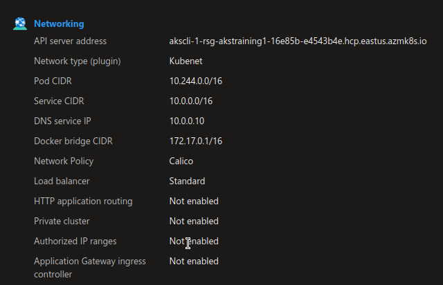
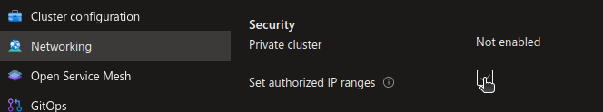
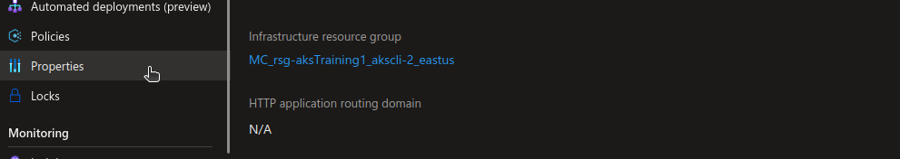
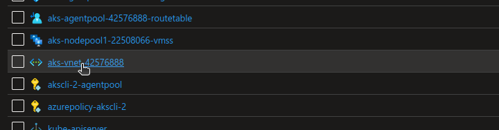
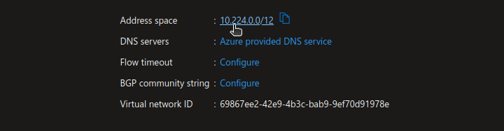

# Protect the API server 

The API server is the one part that we always access in Kubernetes.
In AKS, it is managed by the Azure platform, but still accessible and thus in need of protection, from a networking point of view.
There are more than one way of protecting the API Server. The simplest consist of adding filtering on the API Server, without changing anything to the architecture.
Another option is the use of private endpoint.
## 1. accept list on the API Server

In this session, we will look at the basic network protection on the API Server.
Let's start by navigating to the Azure portal, to have a look at the cluster network configuration:

 
  
We can also check the accept llist through the az cli:

```bash

yumemaru@Azure:~/LabAKS$ az aks list | jq .[1] | grep -i api
  "apiServerAccessProfile": null,


```

We can add easily an accepted IP through the portal:

 

And also check again the configuration from the az cli:

```bash

yumemaru@Azure:~/LabAKS$ az aks list | jq .[1].apiServerAccessProfile
{
  "authorizedIpRanges": [
    "20.19.21.133/32"
  ],
  "disableRunCommand": null,
  "enablePrivateCluster": null,
  "enablePrivateClusterPublicFqdn": null,
  "privateDnsZone": null
}


```

With tha az cli, adding an IP to the accept list is done with the following command:

```bash

yumemaru@Azure:~/LabAKS$ az aks update -n akscli-1 -g rsg-akstraining1 --api-server-authorized-ip-ranges 20.19.21.137

```

The IPs that we added are IP from the Azure platform ranges. If we try to connect from another IP, we should not be able to access.
Let's verify:

- Start by resetting your config file

```bash

yumemaru@Azure:~/LabAKS$ rm ~/.kube/config

```
  
- Then get the credentials from az cli


```bash

yumemaru@Azure:~/LabAKS$ az aks get-credentials -n akscli-1 -g rsg-akstraining1
Merged "akscli-1" as current context in /home/df/.kube/config

```

- Verify that the kube config is pointing to the aks cluster:


```bash

yumemaru@Azure:~/LabAKS$ k config current-context 
akscli-1

```

Now let's try to get some object through the API server:


```bash

yumemaru@Azure:~/LabAKS$ k get nodes
Unable to connect to the server: dial tcp 52.226.5.114:443: i/o timeout

```

It seems to be working, let's try to allow ourself access by getting our own Public IP and adding it to the API accept list: 
If everything works correctly, we should be able to interact with the cluster:


```bash

yumemaru@Azure:~/LabAKS$ k get nodes
NAME                                STATUS   ROLES   AGE   VERSION
aks-nodepool1-23978515-vmss000003   Ready    agent   24h   v1.24.3
aks-nodepool1-23978515-vmss000004   Ready    agent   24h   v1.24.3
aks-nodepool1-23978515-vmss000005   Ready    agent   24h   v1.24.3

```

Note: to get your ip from cloud shell, you can use the following commands: 

```bash

yumemaru@Azure:~/LabAKS$ dig @resolver1.opendns.com myip.opendns.com +short

yumemaru@Azure:~/LabAKS$ curl ifconfig.me/ip

```

## 2. private cluster

It may be that a simple Firewall rule against the API server is not considered secured enough.
In this case the private cluster is a possible target.
It relies on Private Link Private Endpoint technology which NAT a PaaS instance to a Network Interface Card in a virtual network.
There are many consideration to take into account when designing a global strategy for PaaS service.
In the following example, we will do it the easy way, and only create a cluster with a Private Endpoint, but without DNS to configure

```bash

yumemaru@Azure:~/LabAKS$ az aks create --resource-group rsg-aksTraining1 --name akscli-2 --enable-aad --enable-oidc-issuer --load-balancer-sku standard --location eastus --network-plugin kubenet --network-policy calico --zones 1 2 3 --enable-private-cluster

```

Once the cluster is created, we can check on the portal the network configuration:

 

Or through cli:

```bash

yumemaru@Azure:~/LabAKS$ az aks list | jq .[].name
"aks-1"
"akscli-1"
"akscli-2"
"aks-2"
"aks-3"
yumemaru@Azure:~/LabAKS$ az aks list | jq .[2].apiServerAccessProfile
{
  "authorizedIpRanges": null,
  "disableRunCommand": null,
  "enablePrivateCluster": true,
  "enablePrivateClusterPublicFqdn": true,
  "privateDnsZone": "system"
}

```

Note that in private cluster mode, there is no need for accept list, hence the message on the portal.

Note also the configuration state with the `` set to true. 
We did the simple private cluster, with no DNS configuration at all. The fqdn is still public but the IP address associated to the API fqdn is private:

```bash

yumemaru@Azure:~/LabAKS$ az aks list | jq .[2].fqdn
"akscli-2-rsg-akstraining1-16e85b-fe0aca62.hcp.eastus.azmk8s.io"
yumemaru@Azure:~/LabAKS$ nslookup akscli-2-rsg-akstraining1-16e85b-fe0aca62.hcp.eastus.azmk8s.io
Server:         127.0.0.53
Address:        127.0.0.53#53

Non-authoritative answer:
Name:   akscli-2-rsg-akstraining1-16e85b-fe0aca62.hcp.eastus.azmk8s.io
Address: 10.224.0.4

```

Looking into the cluster configuration, we should see the associated virtual network

 

 

 

We do have a IP from the virtual network of the cluster.

Let's try to connect to the cluster from outside the Virtual Network:

```bash

yumemaru@Azure:~/LabAKS$ az aks get-credentials -n akscli-2 -g rsg-akstraining1
Merged "akscli-2" as current context in /home/df/.kube/config

yumemaru@Azure:~/LabAKS$ k config current-context 
akscli-2

yumemaru@Azure:~/LabAKS$ k get nodes
To sign in, use a web browser to open the page https://microsoft.com/devicelogin and enter the code DKE57TD29 to authenticate.
Unable to connect to the server: dial tcp: lookup akscli-2-rsg-akstraining1-16e85b-607ecced.afe64896-53c5-43f3-9ba5-cb8a346578b7.privatelink.eastus.azmk8s.io on 127.0.0.53:53: no such host

```

Because our cluster is private, connection is not possible.