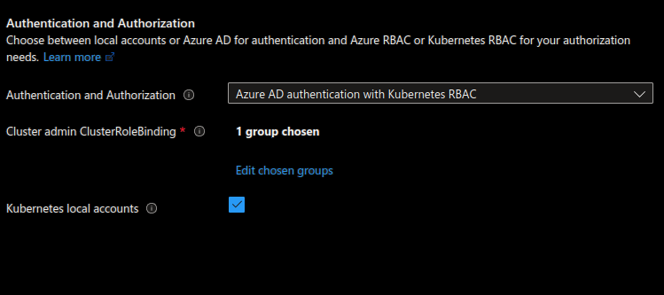
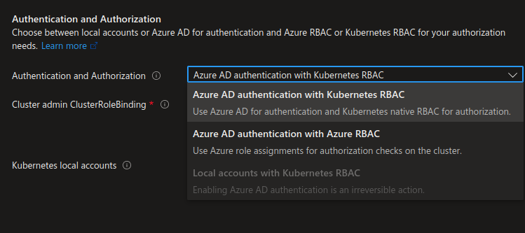
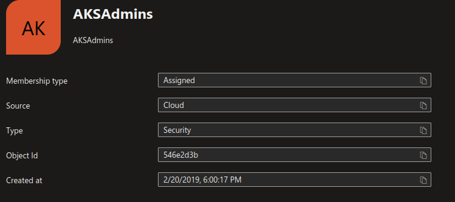

# Manipulate RBAC

RBAC is available to segregates access inside a Kubernetes cluster.
Considering AKS, there are 2 level of RBAC:

- The Azure plane
- The Kubernetes plane

In the Azure plane, the RBAC configuration start at the cluster creation with the `az aks create` cli parameter `--aad-admin-group-object-ids`

After the creation, the group specified is visible in the portal (The Group Id is hiden in the screen below)

 

Or in the az cli

```bash

yumemaru@Azure:~/LabAKS$ az aks list | jq .[1].aadProfile
{
  "adminGroupObjectIDs": [
    "00000000-0000-0000-0000-000000000000"
  ],
  "adminUsers": null,
  "clientAppId": null,
  "enableAzureRbac": false,
  "managed": true,
  "serverAppId": null,
  "serverAppSecret": null,
  "tenantId": "00000000-0000-0000-0000-000000000000"
}

```
Rbac enabled state is seen through the `enableRBAC` argument:

```bash

yumemaru@Azure:~/LabAKS$ az aks list | jq .[1].enableRbac
true

```
Note that there are differents options for RBAC:



When the parameter `enableAzureRbac` is set to true, the cluster is configured to use both Kubernetes roles and Azure roles. In this case, Azure RBAC roles can be used to grant access on the cluster.

## 1. RBAC role in Kubernetes

In the Kubernetes plane, it is possible to check the correlation between the AAD admin group and the cluster-admin role.
For this, we need to check the `clusterrolebinding`:

```bash

yumemaru@Azure:~/LabAKS$ k get clusterrolebindings.rbac.authorization.k8s.io | grep -i cluster-admin
aks-cluster-admin-binding                              ClusterRole/cluster-admin                                                          2d23h
aks-cluster-admin-binding-aad                          ClusterRole/cluster-admin                                                          2d23h
cluster-admin                                          ClusterRole/cluster-admin  

```

There are only 3 binding to the cluster role. Looking at the binding `aks-cluster-admin-binding-aad` in details, we should see the subject with an guid:

```bash

yumemaru@Azure:~/LabAKS$ k get clusterrolebindings.rbac.authorization.k8s.io aks-cluster-admin-binding-aad -o jsonpath='{.subjects}'
[{"apiGroup":"rbac.authorization.k8s.io","kind":"Group","name":"546e2d3b-0000-0000-0000-000000000000"}]

```

This guid is the object id of the AAD group that is assigned to the cluster:



In a AAD enbled AKS cluster, RBAC binding can point to AAD assets.
When the subject target is a group, we use the subject id, when the subject is a user, we use the upn.

We will now create an rbac assignment for a test user, using the clusterrole `admin`

```bash

yumemaru@Azure:~/LabAKS$ k get clusterrole admin -o yaml

```


```yaml

aggregationRule:
  clusterRoleSelectors:
  - matchLabels:
      rbac.authorization.k8s.io/aggregate-to-admin: "true"
apiVersion: rbac.authorization.k8s.io/v1
kind: ClusterRole
metadata:
  annotations:
    rbac.authorization.kubernetes.io/autoupdate: "true"
  creationTimestamp: "2022-12-02T16:15:03Z"
  labels:
    kubernetes.io/bootstrapping: rbac-defaults
  name: admin
  resourceVersion: "43593"
  uid: 6909aa08-6768-4c5c-b6ab-94407c0ede25
rules:
- apiGroups:
  - ""
  resources:
  - pods/attach
  - pods/exec
  - pods/portforward
  - pods/proxy
  - secrets
  - services/proxy
  verbs:
  - get
  - list
  - watch
- apiGroups:
  - ""
  resources:
  - serviceaccounts
  verbs:
  - impersonate
- apiGroups:
  - ""
  resources:
  - pods
  - pods/attach
  - pods/exec
  - pods/portforward
  - pods/proxy
  verbs:
  - create
  - delete
  - deletecollection
  - patch
  - update
- apiGroups:
  - ""
  resources:
  - configmaps
  - events
  - persistentvolumeclaims
  - replicationcontrollers
  - replicationcontrollers/scale
  - secrets
  - serviceaccounts
  - services
  - services/proxy
  verbs:
  - create
  - delete
  - deletecollection
  - patch
  - update
- apiGroups:
  - apps
  resources:
  - daemonsets
  - deployments
  - deployments/rollback
  - deployments/scale
  - replicasets
  - replicasets/scale
  - statefulsets
  - statefulsets/scale
  verbs:
  - create
  - delete
  - deletecollection
  - patch
  - update
- apiGroups:
  - autoscaling
  resources:
  - horizontalpodautoscalers
  verbs:
  - create
  - delete
  - deletecollection
  - patch
  - update
- apiGroups:
  - batch
  resources:
  - cronjobs
  - jobs
  verbs:
  - create
  - delete
  - deletecollection
  - patch
  - update
- apiGroups:
  - extensions
  resources:
  - daemonsets
  - deployments
  - deployments/rollback
  - deployments/scale
  - ingresses
  - networkpolicies
  - replicasets
  - replicasets/scale
  - replicationcontrollers/scale
  verbs:
  - create
  - delete
  - deletecollection
  - patch
  - update
- apiGroups:
  - policy
  resources:
  - poddisruptionbudgets
  verbs:
  - create
  - delete
  - deletecollection
  - patch
  - update
- apiGroups:
  - networking.k8s.io
  resources:
  - ingresses
  - networkpolicies
  verbs:
  - create
  - delete
  - deletecollection
  - patch
  - update
- apiGroups:
  - ""
  resources:
  - pods/eviction
  verbs:
  - create
- apiGroups:
  - ""
  resources:
  - serviceaccounts/token
  verbs:
  - create
- apiGroups:
  - ""
  resources:
  - configmaps
  - endpoints
  - persistentvolumeclaims
  - persistentvolumeclaims/status
  - pods
  - replicationcontrollers
  - replicationcontrollers/scale
  - serviceaccounts
  - services
  - services/status
  verbs:
  - get
  - list
  - watch
- apiGroups:
  - ""
  resources:
  - bindings
  - events
  - limitranges
  - namespaces/status
  - pods/log
  - pods/status
  - replicationcontrollers/status
  - resourcequotas
  - resourcequotas/status
  verbs:
  - get
  - list
  - watch
- apiGroups:
  - ""
  resources:
  - namespaces
  verbs:
  - get
  - list
  - watch
- apiGroups:
  - discovery.k8s.io
  resources:
  - endpointslices
  verbs:
  - get
  - list
  - watch
- apiGroups:
  - apps
  resources:
  - controllerrevisions
  - daemonsets
  - daemonsets/status
  - deployments
  - deployments/scale
  - deployments/status
  - replicasets
  - replicasets/scale
  - replicasets/status
  - statefulsets
  - statefulsets/scale
  - statefulsets/status
  verbs:
  - get
  - list
  - watch
- apiGroups:
  - autoscaling
  resources:
  - horizontalpodautoscalers
  - horizontalpodautoscalers/status
  verbs:
  - get
  - list
  - watch
- apiGroups:
  - batch
  resources:
  - cronjobs
  - cronjobs/status
  - jobs
  - jobs/status
  verbs:
  - get
  - list
  - watch
- apiGroups:
  - extensions
  resources:
  - daemonsets
  - daemonsets/status
  - deployments
  - deployments/scale
  - deployments/status
  - ingresses
  - ingresses/status
  - networkpolicies
  - replicasets
  - replicasets/scale
  - replicasets/status
  - replicationcontrollers/scale
  verbs:
  - get
  - list
  - watch
- apiGroups:
  - policy
  resources:
  - poddisruptionbudgets
  - poddisruptionbudgets/status
  verbs:
  - get
  - list
  - watch
- apiGroups:
  - networking.k8s.io
  resources:
  - ingresses
  - ingresses/status
  - networkpolicies
  verbs:
  - get
  - list
  - watch
- apiGroups:
  - authorization.k8s.io
  resources:
  - localsubjectaccessreviews
  verbs:
  - create
- apiGroups:
  - rbac.authorization.k8s.io
  resources:
  - rolebindings
  - roles
  verbs:
  - create
  - delete
  - deletecollection
  - get
  - list
  - patch
  - update
  - watch

```

To create the role binding, we use the following manifest:

```yaml

apiVersion: rbac.authorization.k8s.io/v1
kind: RoleBinding
metadata:
  name: testrolebinding
  namespace: ingressapp-demo
roleRef:
  apiGroup: rbac.authorization.k8s.io
  kind: ClusterRole
  name: admin
subjects:
- apiGroup: rbac.authorization.k8s.io
  kind: User
  name: <user_upn>

```

Note that the we have a role binding but the role reference is a `ClusterRole`. 
This is one important point. Role Binding can take as role reference both `Role` or `ClusterRole`.
However, the binding is scoped to the target resources, in this example, to the namespace `ingressapp-demo`.

Note also, to get the credentials, the user needs to be assigned the `Azure Kubernetes Service Cluster User Role`.

```json

{
  "assignableScopes": [
    "/"
  ],
  "description": "List cluster user credential action.",
  "id": "/subscriptions/{subscriptionId}/providers/Microsoft.Authorization/roleDefinitions/4abbcc35-e782-43d8-92c5-2d3f1bd2253f",
  "name": "4abbcc35-e782-43d8-92c5-2d3f1bd2253f",
  "permissions": [
    {
      "actions": [
        "Microsoft.ContainerService/managedClusters/listClusterUserCredential/action",
        "Microsoft.ContainerService/managedClusters/read"
      ],
      "notActions": [],
      "dataActions": [],
      "notDataActions": []
    }
  ],
  "roleName": "Azure Kubernetes Service Cluster User Role",
  "roleType": "BuiltInRole",
  "type": "Microsoft.Authorization/roleDefinitions"
}

```

Kubectl includes command to check access for user. To check access for our test user, we can use the following:

```bash

yumemaru@Azure:~/LabAKS$ kubectl auth can-i get pod --namespace ingressapp-demo --as <test_user_upn>
yes

yumemaru@Azure:~/LabAKS$ k auth can-i create deployment --namespace ingressapp-demo --as spike@teknews.cloud
yes

yumemaru@Azure:~/LabAKS$ k auth can-i get nodes --as spike@teknews.cloud
Warning: resource 'nodes' is not namespace scoped

no

```


## 2. the local account

There is, by default, a local admin account on AKS cluster.
This local admin can be used by user in AAD with an Azure role allowing to perform the `Microsoft.ContainerService/managedClusters/accessProfiles/listCredential/action` action.

The trouble is that role such as the `contributor` role include this action, and thus allow an escalation of privilege through the `az aks get-credentials  --admin` command.

Try the command and check the kube config context afterward:

```bash

yumemaru@Azure:~/LabAKS$ az aks get-credentials -g rsg-akstraining1 -n akscli-1 --admin
Merged "akscli-1-admin" as current context in /home/df/.kube/config

yumemaru@Azure:~/LabAKS$ k config get-contexts 
CURRENT   NAME             CLUSTER    AUTHINFO                                 NAMESPACE
          akscli-1         akscli-1   clusterUser_rsg-akstraining1_akscli-1    
*         akscli-1-admin   akscli-1   clusterAdmin_rsg-akstraining1_akscli-1 

```

This command can be observed in the activity logs on Azure, either from the portal, or through `az monitor activity-log list` command:

```bash

yumemaru@Azure:~/LabAKS$ az monitor activity-log list --resource-id /subscriptions/100000000-0000-0000-0000-000000000000/resourcegroups/rsg-aksTraining1/providers/Microsoft.ContainerService/managedClusters/akscli-1 --caller david@teknews.cloud | jq .[].authorization.action
"Microsoft.ContainerService/managedClusters/listClusterAdminCredential/action"
"Microsoft.ContainerService/managedClusters/listClusterAdminCredential/action"
"Microsoft.ContainerService/managedClusters/start/action"
"Microsoft.ContainerService/managedClusters/start/action"
"Microsoft.ContainerService/managedClusters/start/action"
"Microsoft.ContainerService/managedClusters/write"
"Microsoft.ContainerService/managedClusters/write"
"Microsoft.ContainerService/managedClusters/write"
"Microsoft.ContainerService/managedClusters/write"
"Microsoft.ContainerService/managedClusters/write"
"Microsoft.ContainerService/managedClusters/write"
"Microsoft.ContainerService/managedClusters/write"
"Microsoft.ContainerService/managedClusters/write"
"Microsoft.ContainerService/managedClusters/write"
"Microsoft.ContainerService/managedClusters/write"
"Microsoft.ContainerService/managedClusters/write"
"Microsoft.ContainerService/managedClusters/write"

```

to counter this, it is possible to deactivate the local account from the API, meaning from az cli, or the portal (or other...).
We can start by checking the configuration of the local account:

```bash

yumemaru@Azure:~/LabAKS$ az aks show -n akscli-1 -g rsg-akstraining1 | jq .disableLocalAccounts
false

```

And then disable the local admin account:

```bash

yumemaru@Azure:~/LabAKS$ az aks update -n akscli-1 -g rsg-akstraining1 --disable-local-accounts
{
  "aadProfile": {
    "adminGroupObjectIDs": [
      "546e2d3b-450e-4049-8f9c-423e1da3444c"
    ],
    "adminUsers": null,
    "clientAppId": null,
    "enableAzureRbac": false,
    "managed": true,
    "serverAppId": null,
    "serverAppSecret": null,
    "tenantId": "00000000-0000-0000-0000-000000000000"
  },
  "addonProfiles": {
    "azurepolicy": {
      "config": null,
      "enabled": true,
      "identity": {
        "clientId": "00000000-0000-0000-0000-000000000000",
        "objectId": "00000000-0000-0000-0000-000000000000",
        "resourceId": "/subscriptions/100000000-0000-0000-0000-000000000000/resourcegroups/MC_rsg-aksTraining1_akscli-1_eastus/providers/Microsoft.ManagedIdentity/userAssignedIdentities/azurepolicy-akscli-1"
      }
    },
    "httpApplicationRouting": {
      "config": null,
      "enabled": false,
      "identity": null
    }
  },
  "agentPoolProfiles": [
    {
      "availabilityZones": [
        "1",
        "2",
        "3"
      ],
      "count": 3,
      "creationData": null,
      "currentOrchestratorVersion": "1.24.3",
      "enableAutoScaling": true,
      "enableEncryptionAtHost": false,
      "enableFips": false,
      "enableNodePublicIp": false,
      "enableUltraSsd": false,
      "gpuInstanceProfile": null,
      "hostGroupId": null,
      "kubeletConfig": null,
      "kubeletDiskType": "OS",
      "linuxOsConfig": null,
      "maxCount": 6,
      "maxPods": 110,
      "minCount": 3,
      "mode": "System",
      "name": "nodepool1",
      "nodeImageVersion": "AKSUbuntu-1804gen2containerd-2022.11.02",
      "nodeLabels": null,
      "nodePublicIpPrefixId": null,
      "nodeTaints": [
        "CriticalAddonsOnly=true:NoSchedule"
      ],
      "orchestratorVersion": "1.24.3",
      "osDiskSizeGb": 128,
      "osDiskType": "Managed",
      "osSku": "Ubuntu",
      "osType": "Linux",
      "podSubnetId": null,
      "powerState": {
        "code": "Running"
      },
      "provisioningState": "Succeeded",
      "proximityPlacementGroupId": null,
      "scaleDownMode": null,
      "scaleSetEvictionPolicy": null,
      "scaleSetPriority": null,
      "spotMaxPrice": null,
      "tags": null,
      "type": "VirtualMachineScaleSets",
      "upgradeSettings": {
        "maxSurge": "33%"
      },
      "vmSize": "Standard_DS2_v2",
      "vnetSubnetId": null,
      "workloadRuntime": null
    },
    {
      "availabilityZones": null,
      "count": 3,
      "creationData": null,
      "currentOrchestratorVersion": "1.24.3",
      "enableAutoScaling": true,
      "enableEncryptionAtHost": false,
      "enableFips": false,
      "enableNodePublicIp": false,
      "enableUltraSsd": false,
      "gpuInstanceProfile": null,
      "hostGroupId": null,
      "kubeletConfig": null,
      "kubeletDiskType": "OS",
      "linuxOsConfig": null,
      "maxCount": 6,
      "maxPods": 110,
      "minCount": 3,
      "mode": "User",
      "name": "nodepool2",
      "nodeImageVersion": "AKSUbuntu-1804gen2containerd-2022.11.12",
      "nodeLabels": null,
      "nodePublicIpPrefixId": null,
      "nodeTaints": null,
      "orchestratorVersion": "1.24.3",
      "osDiskSizeGb": 128,
      "osDiskType": "Managed",
      "osSku": "Ubuntu",
      "osType": "Linux",
      "podSubnetId": null,
      "powerState": {
        "code": "Running"
      },
      "provisioningState": "Succeeded",
      "proximityPlacementGroupId": null,
      "scaleDownMode": "Delete",
      "scaleSetEvictionPolicy": null,
      "scaleSetPriority": null,
      "spotMaxPrice": null,
      "tags": null,
      "type": "VirtualMachineScaleSets",
      "upgradeSettings": {
        "maxSurge": "33%"
      },
      "vmSize": "Standard_DS2_v2",
      "vnetSubnetId": null,
      "workloadRuntime": null
    }
  ],
  "apiServerAccessProfile": null,
  "autoScalerProfile": {
    "balanceSimilarNodeGroups": "false",
    "expander": "random",
    "maxEmptyBulkDelete": "10",
    "maxGracefulTerminationSec": "600",
    "maxNodeProvisionTime": "15m",
    "maxTotalUnreadyPercentage": "45",
    "newPodScaleUpDelay": "0s",
    "okTotalUnreadyCount": "3",
    "scaleDownDelayAfterAdd": "10m",
    "scaleDownDelayAfterDelete": "10s",
    "scaleDownDelayAfterFailure": "3m",
    "scaleDownUnneededTime": "10m",
    "scaleDownUnreadyTime": "20m",
    "scaleDownUtilizationThreshold": "0.5",
    "scanInterval": "10s",
    "skipNodesWithLocalStorage": "false",
    "skipNodesWithSystemPods": "true"
  },
  "autoUpgradeProfile": null,
  "azurePortalFqdn": "akscli-1-rsg-akstraining1-000000-e4543b4e.portal.hcp.eastus.azmk8s.io",
  "currentKubernetesVersion": "1.24.3",
  "disableLocalAccounts": true,
  "diskEncryptionSetId": null,
  "dnsPrefix": "akscli-1-rsg-aksTraining1-000000",
  "enablePodSecurityPolicy": null,
  "enableRbac": true,
  "extendedLocation": null,
  "fqdn": "akscli-1-rsg-akstraining1-000000-e4543b4e.hcp.eastus.azmk8s.io",
  "fqdnSubdomain": null,
  "httpProxyConfig": null,
  "id": "/subscriptions/100000000-0000-0000-0000-000000000000/resourcegroups/rsg-aksTraining1/providers/Microsoft.ContainerService/managedClusters/akscli-1",
  "identity": {
    "principalId": "00000000-0000-0000-0000-000000000000",
    "tenantId": "00000000-0000-0000-0000-000000000000",
    "type": "SystemAssigned",
    "userAssignedIdentities": null
  },
  "identityProfile": {
    "kubeletidentity": {
      "clientId": "00000000-0000-0000-0000-000000000000",
      "objectId": "00000000-0000-0000-0000-000000000000",
      "resourceId": "/subscriptions/100000000-0000-0000-0000-000000000000/resourcegroups/MC_rsg-aksTraining1_akscli-1_eastus/providers/Microsoft.ManagedIdentity/userAssignedIdentities/akscli-1-agentpool"
    }
  },
  "kubernetesVersion": "1.24.3",
  "linuxProfile": {
    "adminUsername": "azureuser",
    "ssh": {
      "publicKeys": [
        {
          "keyData": ""
        }
      ]
    }
  },
  "location": "eastus",
  "maxAgentPools": 100,
  "name": "akscli-1",
  "networkProfile": {
    "dnsServiceIp": "10.0.0.10",
    "dockerBridgeCidr": "172.17.0.1/16",
    "ipFamilies": [
      "IPv4"
    ],
    "loadBalancerProfile": {
      "allocatedOutboundPorts": null,
      "effectiveOutboundIPs": [
        {
          "id": "/subscriptions/100000000-0000-0000-0000-000000000000/resourceGroups/MC_rsg-aksTraining1_akscli-1_eastus/providers/Microsoft.Network/publicIPAddresses/470175d3-c908-4667-ae98-6f74b222056e",
          "resourceGroup": "MC_rsg-aksTraining1_akscli-1_eastus"
        }
      ],
      "enableMultipleStandardLoadBalancers": null,
      "idleTimeoutInMinutes": null,
      "managedOutboundIPs": {
        "count": 1,
        "countIpv6": null
      },
      "outboundIPs": null,
      "outboundIpPrefixes": null
    },
    "loadBalancerSku": "Standard",
    "natGatewayProfile": null,
    "networkMode": null,
    "networkPlugin": "kubenet",
    "networkPolicy": "calico",
    "outboundType": "loadBalancer",
    "podCidr": "10.244.0.0/16",
    "podCidrs": [
      "10.244.0.0/16"
    ],
    "serviceCidr": "10.0.0.0/16",
    "serviceCidrs": [
      "10.0.0.0/16"
    ]
  },
  "nodeResourceGroup": "MC_rsg-aksTraining1_akscli-1_eastus",
  "oidcIssuerProfile": {
    "enabled": true,
    "issuerUrl": "https://eastus.oic.prod-aks.azure.com/00000000-0000-0000-0000-000000000000/728aecf6-13a2-4d60-9d47-0b89e1cda492/"
  },
  "podIdentityProfile": null,
  "powerState": {
    "code": "Running"
  },
  "privateFqdn": null,
  "privateLinkResources": null,
  "provisioningState": "Succeeded",
  "publicNetworkAccess": null,
  "resourceGroup": "rsg-aksTraining1",
  "securityProfile": {
    "azureKeyVaultKms": null,
    "defender": {
      "logAnalyticsWorkspaceResourceId": "/subscriptions/100000000-0000-0000-0000-000000000000/resourcegroups/DefaultResourceGroup-EUS/providers/Microsoft.OperationalInsights/workspaces/DefaultWorkspace-100000000-0000-0000-0000-000000000000-EUS",
      "securityMonitoring": {
        "enabled": true
      }
    }
  },
  "servicePrincipalProfile": {
    "clientId": "msi",
    "secret": null
  },
  "sku": {
    "name": "Basic",
    "tier": "Free"
  },
  "storageProfile": {
    "blobCsiDriver": null,
    "diskCsiDriver": {
      "enabled": true
    },
    "fileCsiDriver": {
      "enabled": true
    },
    "snapshotController": {
      "enabled": true
    }
  },
  "systemData": null,
  "tags": null,
  "type": "Microsoft.ContainerService/ManagedClusters",
  "windowsProfile": null
}


```

the `disableLocalAccounts` should now be set to true:

```bash

yumemaru@Azure:~/LabAKS$ az aks show -n akscli-1 -g rsg-akstraining1 | jq .disableLocalAccounts
true

```
If we try again the `az aks get-credentials  --admin` command

```bash

yumemaru@Azure:~/LabAKS$ az aks get-credentials -g rsg-akstraining1 -n akscli-1 --admin
(BadRequest) Getting static credential is not allowed because this cluster is set to disable local accounts.
Code: BadRequest
Message: Getting static credential is not allowed because this cluster is set to disable local accounts.

```

This time, the credentials cannot be claimed.
