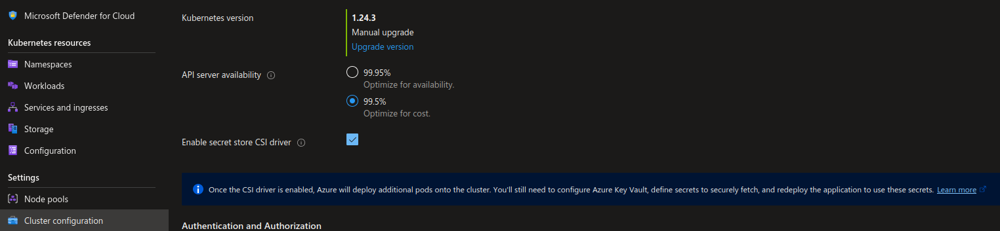

# CSI Secret Store Addon

Add-ons are the easy way proposed by Microsoft to install features on AKS without having to manage update and support.
Available as an add-on is the Azure Key Vault CSI Secret store.

To install the add-on, we can use the portal or any compatible cli.
From the portal, it's as simple as selecting a box:



Through the cli, it is performed with the following command:

```bash

az aks enable-addons --addons azure-keyvault-secrets-provider --name akscli-1 --resource-group rsg-akstraining1
{
  "aadProfile": {
    "adminGroupObjectIDs": [
      "00000000-0000-0000-0000-000000000000"
    ],
    "adminUsers": null,
    "clientAppId": null,
    "enableAzureRbac": false,
    "managed": true,
    "serverAppId": null,
    "serverAppSecret": null,
    "tenantId": "00000000-0000-0000-0000-000000000000"
  },
  "addonProfiles": {
    "azureKeyvaultSecretsProvider": {
      "config": {
        "enableSecretRotation": "false",
        "rotationPollInterval": "2m"
      },
      "enabled": true,
      "identity": {
        "clientId": "00000000-0000-0000-0000-000000000000",
        "objectId": "00000000-0000-0000-0000-000000000000",
        "resourceId": "/subscriptions/00000000-0000-0000-0000-000000000000/resourcegroups/MC_rsg-aksTraining1_akscli-1_eastus/providers/Microsoft.ManagedIdentity/userAssignedIdentities/azurekeyvaultsecretsprovider-akscli-1"
      }
    },
    "azurepolicy": {
      "config": null,
      "enabled": true,
      "identity": {
        "clientId": "5c6273a1-46d3-429a-973f-90787cfb5b4d",
        "objectId": "ea9081de-657d-41e0-b64a-da6a70bdcf4c",
        "resourceId": "/subscriptions/00000000-0000-0000-0000-000000000000/resourcegroups/MC_rsg-aksTraining1_akscli-1_eastus/providers/Microsoft.ManagedIdentity/userAssignedIdentities/azurepolicy-akscli-1"
      }
    },
    "httpApplicationRouting": {
      "config": null,
      "enabled": false,
      "identity": null
    }
  },
  "agentPoolProfiles": [
    {
      "availabilityZones": [
        "1",
        "2",
        "3"
      ],
      "count": 3,
      "creationData": null,
      "currentOrchestratorVersion": "1.24.3",
      "enableAutoScaling": true,
      "enableEncryptionAtHost": false,
      "enableFips": false,
      "enableNodePublicIp": false,
      "enableUltraSsd": false,
      "gpuInstanceProfile": null,
      "hostGroupId": null,
      "kubeletConfig": null,
      "kubeletDiskType": "OS",
      "linuxOsConfig": null,
      "maxCount": 6,
      "maxPods": 110,
      "minCount": 3,
      "mode": "System",
      "name": "nodepool1",
      "nodeImageVersion": "AKSUbuntu-1804gen2containerd-2022.11.02",
      "nodeLabels": null,
      "nodePublicIpPrefixId": null,
      "nodeTaints": [
        "CriticalAddonsOnly=true:NoSchedule"
      ],
      "orchestratorVersion": "1.24.3",
      "osDiskSizeGb": 128,
      "osDiskType": "Managed",
      "osSku": "Ubuntu",
      "osType": "Linux",
      "podSubnetId": null,
      "powerState": {
        "code": "Running"
      },
      "provisioningState": "Succeeded",
      "proximityPlacementGroupId": null,
      "scaleDownMode": null,
      "scaleSetEvictionPolicy": null,
      "scaleSetPriority": null,
      "spotMaxPrice": null,
      "tags": null,
      "type": "VirtualMachineScaleSets",
      "upgradeSettings": {
        "maxSurge": "33%"
      },
      "vmSize": "Standard_DS2_v2",
      "vnetSubnetId": null,
      "workloadRuntime": null
    },
    {
      "availabilityZones": null,
      "count": 3,
      "creationData": null,
      "currentOrchestratorVersion": "1.24.3",
      "enableAutoScaling": true,
      "enableEncryptionAtHost": false,
      "enableFips": false,
      "enableNodePublicIp": false,
      "enableUltraSsd": false,
      "gpuInstanceProfile": null,
      "hostGroupId": null,
      "kubeletConfig": null,
      "kubeletDiskType": "OS",
      "linuxOsConfig": null,
      "maxCount": 6,
      "maxPods": 110,
      "minCount": 3,
      "mode": "User",
      "name": "nodepool2",
      "nodeImageVersion": "AKSUbuntu-1804gen2containerd-2022.11.12",
      "nodeLabels": null,
      "nodePublicIpPrefixId": null,
      "nodeTaints": null,
      "orchestratorVersion": "1.24.3",
      "osDiskSizeGb": 128,
      "osDiskType": "Managed",
      "osSku": "Ubuntu",
      "osType": "Linux",
      "podSubnetId": null,
      "powerState": {
        "code": "Running"
      },
      "provisioningState": "Succeeded",
      "proximityPlacementGroupId": null,
      "scaleDownMode": "Delete",
      "scaleSetEvictionPolicy": null,
      "scaleSetPriority": null,
      "spotMaxPrice": null,
      "tags": null,
      "type": "VirtualMachineScaleSets",
      "upgradeSettings": {
        "maxSurge": "33%"
      },
      "vmSize": "Standard_DS2_v2",
      "vnetSubnetId": null,
      "workloadRuntime": null
    }
  ],
  "apiServerAccessProfile": null,
  "autoScalerProfile": {
    "balanceSimilarNodeGroups": "false",
    "expander": "random",
    "maxEmptyBulkDelete": "10",
    "maxGracefulTerminationSec": "600",
    "maxNodeProvisionTime": "15m",
    "maxTotalUnreadyPercentage": "45",
    "newPodScaleUpDelay": "0s",
    "okTotalUnreadyCount": "3",
    "scaleDownDelayAfterAdd": "10m",
    "scaleDownDelayAfterDelete": "10s",
    "scaleDownDelayAfterFailure": "3m",
    "scaleDownUnneededTime": "10m",
    "scaleDownUnreadyTime": "20m",
    "scaleDownUtilizationThreshold": "0.5",
    "scanInterval": "10s",
    "skipNodesWithLocalStorage": "false",
    "skipNodesWithSystemPods": "true"
  },
  "autoUpgradeProfile": null,
  "azurePortalFqdn": "akscli-1-rsg-akstraining1-16e85b-e4543b4e.portal.hcp.eastus.azmk8s.io",
  "currentKubernetesVersion": "1.24.3",
  "disableLocalAccounts": true,
  "diskEncryptionSetId": null,
  "dnsPrefix": "akscli-1-rsg-aksTraining1-16e85b",
  "enablePodSecurityPolicy": null,
  "enableRbac": true,
  "extendedLocation": null,
  "fqdn": "akscli-1-rsg-akstraining1-16e85b-e4543b4e.hcp.eastus.azmk8s.io",
  "fqdnSubdomain": null,
  "httpProxyConfig": null,
  "id": "/subscriptions/00000000-0000-0000-0000-000000000000/resourcegroups/rsg-aksTraining1/providers/Microsoft.ContainerService/managedClusters/akscli-1",
  "identity": {
    "principalId": "681f5a2f-38a3-4fca-90b3-6ddf79b1f2dd",
    "tenantId": "00000000-0000-0000-0000-000000000000",
    "type": "SystemAssigned",
    "userAssignedIdentities": null
  },
  "identityProfile": {
    "kubeletidentity": {
      "clientId": "00000000-0000-0000-0000-000000000000",
      "objectId": "00000000-0000-0000-0000-000000000000",
      "resourceId": "/subscriptions/00000000-0000-0000-0000-000000000000/resourcegroups/MC_rsg-aksTraining1_akscli-1_eastus/providers/Microsoft.ManagedIdentity/userAssignedIdentities/akscli-1-agentpool"
    }
  },
  "kubernetesVersion": "1.24.3",
  "linuxProfile": {
    "adminUsername": "azureuser",
    "ssh": {
      "publicKeys": [
        {
          "keyData": ""
        }
      ]
    }
  },
  "location": "eastus",
  "maxAgentPools": 100,
  "name": "akscli-1",
  "networkProfile": {
    "dnsServiceIp": "10.0.0.10",
    "dockerBridgeCidr": "172.17.0.1/16",
    "ipFamilies": [
      "IPv4"
    ],
    "loadBalancerProfile": {
      "allocatedOutboundPorts": null,
      "effectiveOutboundIPs": [
        {
          "id": "/subscriptions/00000000-0000-0000-0000-000000000000/resourceGroups/MC_rsg-aksTraining1_akscli-1_eastus/providers/Microsoft.Network/publicIPAddresses/470175d3-c908-4667-ae98-6f74b222056e",
          "resourceGroup": "MC_rsg-aksTraining1_akscli-1_eastus"
        }
      ],
      "enableMultipleStandardLoadBalancers": null,
      "idleTimeoutInMinutes": null,
      "managedOutboundIPs": {
        "count": 1,
        "countIpv6": null
      },
      "outboundIPs": null,
      "outboundIpPrefixes": null
    },
    "loadBalancerSku": "Standard",
    "natGatewayProfile": null,
    "networkMode": null,
    "networkPlugin": "kubenet",
    "networkPolicy": "calico",
    "outboundType": "loadBalancer",
    "podCidr": "10.244.0.0/16",
    "podCidrs": [
      "10.244.0.0/16"
    ],
    "serviceCidr": "10.0.0.0/16",
    "serviceCidrs": [
      "10.0.0.0/16"
    ]
  },
  "nodeResourceGroup": "MC_rsg-aksTraining1_akscli-1_eastus",
  "oidcIssuerProfile": {
    "enabled": true,
    "issuerUrl": "https://eastus.oic.prod-aks.azure.com/00000000-0000-0000-0000-000000000000/728aecf6-13a2-4d60-9d47-0b89e1cda492/"
  },
  "podIdentityProfile": null,
  "powerState": {
    "code": "Running"
  },
  "privateFqdn": null,
  "privateLinkResources": null,
  "provisioningState": "Succeeded",
  "publicNetworkAccess": null,
  "resourceGroup": "rsg-aksTraining1",
  "securityProfile": {
    "azureKeyVaultKms": null,
    "defender": {
      "logAnalyticsWorkspaceResourceId": "/subscriptions/00000000-0000-0000-0000-000000000000/resourcegroups/DefaultResourceGroup-EUS/providers/Microsoft.OperationalInsights/workspaces/DefaultWorkspace-00000000-0000-0000-0000-000000000000-EUS",
      "securityMonitoring": {
        "enabled": true
      }
    }
  },
  "servicePrincipalProfile": {
    "clientId": "msi",
    "secret": null
  },
  "sku": {
    "name": "Basic",
    "tier": "Free"
  },
  "storageProfile": {
    "blobCsiDriver": null,
    "diskCsiDriver": {
      "enabled": true
    },
    "fileCsiDriver": {
      "enabled": true
    },
    "snapshotController": {
      "enabled": true
    }
  },
  "systemData": null,
  "tags": null,
  "type": "Microsoft.ContainerService/ManagedClusters",
  "windowsProfile": null
}

```

Once installed, it can be checked through the following command:


```bash

yumemaru@Azure:~/LabAKS$ az aks list | jq .[1].addonProfiles.azureKeyvaultSecretsProvider
{
  "config": {
    "enableSecretRotation": "false",
    "rotationPollInterval": "2m"
  },
  "enabled": true,
  "identity": {
    "clientId": "00000000-0000-0000-0000-000000000000",
    "objectId": "00000000-0000-0000-0000-000000000000",
    "resourceId": "/subscriptions/00000000-0000-0000-0000-000000000000/resourcegroups/MC_rsg-aksTraining1_akscli-1_eastus/providers/Microsoft.ManagedIdentity/userAssignedIdentities/azurekeyvaultsecretsprovider-akscli-1"
  }
}

```

And we can see the additional resources inside kube-system:

```bash

yumemaru@Azure:~/LabAKS$ k get ds -n kube-system | grep -i secrets
aks-secrets-store-csi-driver               6         6         6       6            6           <none>          34m
aks-secrets-store-csi-driver-windows       0         0         0       0            0           <none>          34m
aks-secrets-store-provider-azure           6         6         6       6            6           <none>          34m
aks-secrets-store-provider-azure-windows   0         0         0       0            0           <none>          34m


```

For now, there is no Azure Key Vault connected to AKS.
We need to first create a Key Vault:

```bash

yumemaru@Azure:~/LabAKS$ az keyvault create --name "akscli-03-kv" --resource-group "rsg-aksTraining1" --location "EastUS"

```

Then we can create the SecretProviderClasse.
Some parameters need to be filled in:

- The name of the Secret Provider Class
- The Id of the Managed IDentity created at the Addon installation. We also need to grant acces to this identity on the Key Vault so that it can read the secret
- The Key Vault Name
- The object in the Key Vault that we want to expose through the Secret Store CSI

**Note**: There is no need to use an alias. By default, ObjectAlias and ObjectName will be the same.

**Note**: It is possible to refer to a specific version of a secret. By doing so, there is no rotation of the secret possible.

Get the Identity deployed for the Key Vault CSI:

```bash


```

Add an access policy to this identity:

```bash


```

Add also an access policy to yourself to be able to create a secret:

```bash


```

Create a secret in the Key Vault:

```bash


```

Now we can create the SecretProviderClass:

```yaml

apiVersion: secrets-store.csi.x-k8s.io/v1alpha1
kind: SecretProviderClass
metadata:
  name: ${SecretProviderClassName}
spec:
  provider: azure
  parameters:
    useVMManagedIdentity: "true"               
    userAssignedIdentityID: ${CSIAddonUAIClientId}
    keyvaultName: ${KVName}
    cloudName: ""                               
    objects:  |
      array:
        - |
          objectName: ${SecretName}
          objectAlias: ${SecretName}            
          objectType: secret                    
          objectVersion: ${SecretVersion}       
    tenantId: ${TenantId}                      

```

And a Pod with the secret mounted as a CSI volume

```yaml

apiVersion: v1
kind: Pod
metadata:
  name: ${PodName}
spec:
  containers:
    - name: nginx
      image: nginx
      volumeMounts:
        - name: secrets-store-inline
          mountPath: "/mnt/secrets-store"
          readOnly: true
  volumes:
    - name: secrets-store-inline
      csi:
        driver: secrets-store.csi.k8s.io
        readOnly: true
        volumeAttributes:
          secretProviderClass: ${SecretProviderClassName}

```